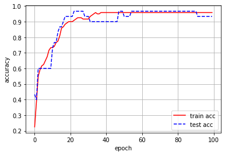

* 编程作业：  
Iris 数据集是常用的分类实验数据集，由Fisher, 1936收集整理。 Iris也称鸢尾花卉数据集，是一类多重变量分析的数据集。数据集包含 150 个数据样本，分为3类，每类50个数据，每个数据包含4个属性。可通过花萼长度，花萼宽度，花瓣长度，花瓣宽度 4 个属性预测鸢尾花卉属于（ Setosa VersicolourVirginica ）三个种类中的哪一类。
* 数据下载： http://archive.ics.uci.edu/ml/datasets/iris  
* 编程设计三层 BP 神经网络实现 Iris 数据集的分类


```python
from sklearn.datasets import load_iris
import math
import numpy as np
import matplotlib.pyplot as plt
iris = load_iris()
dataset=iris.data
dataset_label=iris.target
order = np.random.permutation(np.arange(150))
shuffled_dataset = dataset[order, :]
shuffled_labels = dataset_label[order]
trainset = list(shuffled_dataset[:120, :])
train_label = list(shuffled_labels[:120])
testset = list(shuffled_dataset[120:, :])
test_label = list(shuffled_labels[120:])
```


```python
def sigmoid(x):
    return 1/(1+math.exp(-x))  
```


```python
def dsigmoid(x):
    return sigmoid(x)*(1-sigmoid(x))  
```


```python
class Neuralnet:
    def __init__(self, ni, nh, no):
        self.ni=ni
        self.nh=nh
        self.no=no
        self.ai=[0.0] * ni
        self.ah=[0.0] * nh
        self.ao=[0.0] * no
        self.wi= list(np.random.rand(ni, nh))
        self.wo= list(np.random.rand(nh, no))
     
    def forward(self, inputs):
        """前向传播"""
        if len(inputs) != self.ni:
            raise ValueError('与输入层节点数不符！')

        # 激活输入层
        for i in range(self.ni): 
            self.ai[i] = inputs[i]

        # 激活隐藏层
        for j in range(self.nh):
            sum = 0.0
            for i in range(self.ni):
                sum = sum + self.ai[i] * self.wi[i][j] 
            self.ah[j] = sigmoid(sum)

        # 激活输出层
        for k in range(self.no):
            sum = 0.0
            for j in range(self.nh):
                sum = sum + self.ah[j] * self.wo[j][k]
            self.ao[k] = sigmoid(sum)

        return self.ao[:]

    def backPropagate(self, target, lr):
        """ 反向传播 """
        # 计算输出层的误差
        output_deltas = [0.0] * self.no
        if target==0:
            targets=[1, 0, 0]
        elif target==1:
            targets=[0, 1, 0]
        else:
            targets=[0, 0, 1]
            
        for k in range(self.no):
            error = targets[k] - self.ao[k] 
            output_deltas[k] = dsigmoid(self.ao[k]) * error

        # 计算隐藏层的误差
        hidden_deltas = [0.0] * self.nh 
        for j in range(self.nh):
            error = 0.0
            for k in range(self.no):
                error = error + output_deltas[k] * self.wo[j][k]
            hidden_deltas[j] = dsigmoid(self.ah[j]) * error

        # 更新输出层权重
        for j in range(self.nh):
            for k in range(self.no):
                change = output_deltas[k] * self.ah[j]
                self.wo[j][k] = self.wo[j][k] + lr * change

        # 更新输入层权重
        for i in range(self.ni):
            for j in range(self.nh):
                change = hidden_deltas[j] * self.ai[i] 
                self.wi[i][j] = self.wi[i][j] + lr * change

        # 计算误差
        error = 0.0
        for k in range(self.no):
            error += 0.5 * (targets[k] - self.ao[k]) ** 2
            
        return error
```


```python
epoch=100
lr=0.1
trian_acc=[0.0]*epoch
test_acc=[0.0]*epoch
X = Neuralnet(4, 25, 3)
for i in range(epoch):
    correct_amount=0
    test_correct_amount=0
    for j in range(len(train_label)):
        result=X.forward(trainset[j])
        X.backPropagate(train_label[j], lr)
        if list(np.where(result==np.max(result)))==train_label[j]:
            correct_amount+=1
    trian_acc[i]=correct_amount/len(train_label)
    for l in range(len(test_label)):
        result1=X.forward(testset[l])
        if list(np.where(result1==np.max(result1)))==test_label[l]:
            test_correct_amount+=1
    test_acc[i]=test_correct_amount/len(test_label)
x = np.arange(epoch)
y = np.array(trian_acc)
z= np.array(test_acc)
plt.xlabel("epoch")
plt.ylabel("accuracy")
plt.plot(x, y, '-r', label = 'train acc')
plt.plot(x, z, '--b', label = 'test acc')
plt.grid()
plt.legend()
plt.show()
```


    

    


* 实验结论： 
从最后得到的实验结果可以看到经过100个epoch后，训练精度和测试精度都达到0.9以上甚至更高，较好地实现了分类的目标。
